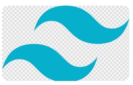
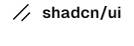

<h1>Site E-Commerce</h1> 

 

 
 

   
   <a href="#-tecnologias">Tecnologias</a>&nbsp;&nbsp;&nbsp;|&nbsp;&nbsp;&nbsp;
   <a href="#-projeto">Projeto</a>&nbsp;&nbsp;&nbsp;|&nbsp;&nbsp;&nbsp;
   <a href="#-layout">Layout</a>&nbsp;&nbsp;&nbsp;|&nbsp;&nbsp;&nbsp;
 

  ## Tecnologias 
  <ul>
    <li>HTML e CSS</li>
    <li>JavaScript</li>
    <li>Git e Github</li>
    <li>Figma</li>
  </ul>

## Projeto

O Projeto  foi criado usando React com Vite, Tailwind CSS e Shadcn-UI
 
 

  
  
  
 

 ## Layout
 pode se analisar o layout atraves [Desse Link]-(https://www.figma.com/design/cfb4F7ZXMFQmvmTn3PKI4z/DRIP-STORE---DIGITAL-COLLEGE?node-id=479-1007&t=ubozHPuo5xupjCdJ-0) 

 Feito com ♥ by Digital College [Entre e se escreva em uns de seus curso]-(https://digitalcollege.com.br/)